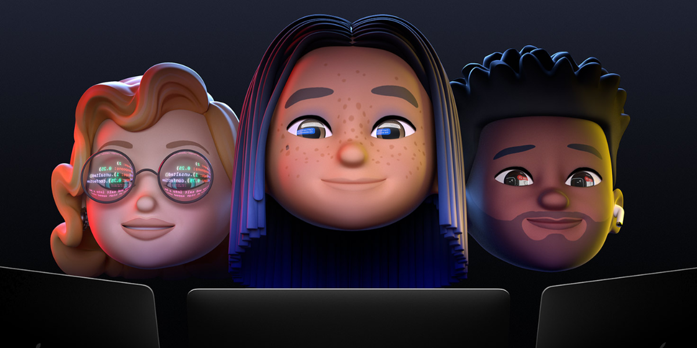

# WWDC 2020 - Swift Student Challenge

List of student submissions for the WWDC 2020 - Swift Student Challenge.

### How to add your submission?
1. [Click here](https://github.com/wwdc/2020/edit/master/Template.md) to fork this repository and edit the `Template.md` file.
2. Fill out the document based on the example in the comment below.
3. Make a new Pull Request and wait for the review.

#### How to update your submission?
If you would like to update your submission status please find your file in `Submission` directory. Edit file, update status and create Pull Request.

### Submissions

| Name | Source |    Video    | Technologies | Status |
|-----:|:------:|:-----------:|:-------------|:------:|
|[Ailton Vieira Pinto Filho](https://twitter.com/ailtonvivaz)|[GitHub](https://github.com/ailtonvivaz/WWDC20Playground)|[YouTube](https://youtu.be/Epffk-v0Oww)|UIKit||
|[Albert Rayneer Queiroz](https://www.instagram.com/albertqueiroz_/)|[GitHub](https://github.com/AlbertQueiroz/MagicFlute-WWDC20)|[YouTube](https://www.youtube.com/watch?v=eYtamPAZ4p0)|UIKit, AVFoundation||
|[Alexander Zank](https://twitter.com/AlexLikePlus)|[GitHub](https://github.com/AlexLike/WWDC20Playground)|[YouTube](https://youtu.be/k_1tqM6LmV0)|SwiftUI, SceneKit, Accelerate, ARKit||
|[Alexandru Turcanu](https://github.com/Pondorasti)|[GitHub](https://github.com/Pondorasti/SimonDraws)|[YouTube](https://youtu.be/KyiXl2NFWHg)|SwiftUI, PencilKit, CoreML, AVFoundation||
|[Aline Gomes de Brito](https://www.linkedin.com/in/aline-gomes-de-brito-379564165/)|[GitHub](https://github.com/gomesalineagb/wwdc2020)|[YouTube](https://www.youtube.com/watch?v=Z-21mbX28VE)|SpriteKit, AVFoundation||
|[Alkan Caner](https://github.com/AlkanCaner)|[GitHub](https://github.com/AlkanCaner/InteractivePicture)|[YouTube](https://www.youtube.com/watch?v=Ght67Ks1Wtg)|SwiftUI||
|[Alvin Hsueh](https://www.instagram.com/qazqwe0922/)|[GitHub](https://github.com/HaXAlvin/WWDC20)|-|SpriteKit, Foundation, UIKit||
|[Amit Samant](https://www.linkedin.com/in/amitsamant-dev/)|[GitHub](https://github.com/DominatorVbN/WWDC20-Submission)|[YouTube](https://youtu.be/dsosgiPSXdo)|SwiftUI, CoreAnimation, SceneKit, ARKit||
|[Antônio Carlos](https://www.linkedin.com/in/ant%C3%B4nio-carlos-corr%C3%AAa-neto-j%C3%BAnior-4a753816b/)|[GitHub](https://github.com/AntonioCarlosCNJ/WWDC_2020)|[YouTube](https://www.youtube.com/watch?v=cl3Ou7SgQn4)|SpriteKit||
|[Anya Sliwinski](https://a-n-y-a.github.io)|[GitHub](https://github.com/a-n-y-a/virus-spread-sim)|-|SpriteKit||
|[Arjun Dureja](https://www.instagram.com/arjun874)|[GitHub](https://github.com/Arjun-dureja/WWDC-Swift-Student-Challenge)|[YouTube](https://www.youtube.com/watch?v=5zoE_7nQ1N4)|UIKit||
|[Artemas J. Radik](https://www.instagram.com/aj_radik/)|[GitHub](https://github.com/magnesiumm/WWDC20-Swift-Student-Challenge)|-|UIKit||
|[Arved Viehweger](https://twitter.com/arvedviehweger)|-|[YouTube](https://www.youtube.com/watch?v=y7FjFwVwM08&feature=youtu.be)|ARKit, SceneKit, UIKit, AVFoundation||
|[Aryan Nambiar](https://twitter.com/ifisq)|[GitHub](https://github.com/ifisq/Build-A-Piano)|-|UIKit, AVFoundation||
|[Askar Almukhametov](https://twitter.com/Metah2909)|[GitHub](https://github.com/MetahCoder/Dombra_playground)|-|AVFoundation, UIKit||
|[Ataberk Turan](https://twitter.com/ataberk_trn)|[GitHub](https://github.com/ataberkturan/LalopathyAI)|-|SwiftUI, CoreML, Combine||
|[Aurther Nadeem](https://www.instagram.com/aurther_nadeem/)|[GitHub](https://github.com/Aurther-Nadeem/WWDC2020)|-|ARKit, RealityKit, SwiftUI, AVFoundation||
|[Bartłomiej Pluta](https://github.com/bpluta)|[GitHub](https://github.com/bpluta/Artyficial-Camera)|-|SwiftUI, CoreML, AVFoundation||
|[Baskoro Indrayana](https://github.com/baskoroi)|[GitHub](https://github.com/baskoroi/wwdc20-submission)|[YouTube](https://youtu.be/pU6q3clW3w8)|SwiftUI, Combine||
|[Benjamin Hutter](https://www.instagram.com/benjaminhtr/)|[GitHub](https://github.com/benjaminhtr/WWDC20)|-|UIKit, CoreML, Vision, AVFoundation||
|[Benji Burgess](https://twitter.com/benjjiburgess)|[GitHub](https://github.com/benjiburgess/WWDC20-Scholarship)|-|SwiftUI||
|[Berkin Ceylan](https://twitter.com/BerkinCeylan)|[GitHub](https://github.com/berkinceylan/WWDC20)|[YouTube](https://www.youtube.com/watch?v=uN7Ea_Ihduw)|SwiftUI||
|[Bradley Klemick](https://bradztech.com)|[GitHub](https://github.com/BradzTech/GravityPlayground)|-|SpriteKit||
|[Bruno Pastre](https://instagram.com/pastresome)|[GitHub](https://github.com/pastre/wwdc2020)|[YouTube](https://www.youtube.com/watch?v=5ewAP9lBV40)|SpriteKit||
|[Bryanza Novirahman](https://twitter.com/bnrvideos)|[GitHub](https://github.com/bryanzanr/go-cli)|[YouTube](https://www.youtube.com/watch?v=yIZjEuULFos)|SwiftUI||
|[BumMo Koo](https://twitter.com/gbmksquare)|[GitHub](https://github.com/gbmksquare/WWDC-2020)|-|SceneKit, AVFoundation, PencilKit||
|[Caio Noronha](https://www.linkedin.com/in/caio-noronha-435745168/)|[GitHub](https://github.com/CaioNoronha/DanceChallenge)|[YouTube](https://www.youtube.com/watch?v=Gfo8tdN4iP8)|SpriteKit, AVFoundation||
|[Cameron Bernhardt](https://twitter.com/AstroCB)|[GitHub](https://github.com/AstroCB/Swift-COVID)|-|AppKit, MapKit||
|[Can Balkaya](https://twitter.com/canbalkya)|[GitHub](https://github.com/canbalkya/Evape-WWDC20)|[YouTube](https://www.youtube.com/watch?v=QMQnLFypW3Y)|SwiftUI||
|[Carlo Palumbo](https://www.linkedin.com/in/carlo-palumbo-992358111/)|[GitHub](https://github.com/patana93/Let-s-Play-With-Digital-Electronics-WWDC20)|[YouTube](https://youtu.be/YgoyxPCzjss)|UIKit||
|[Carlos Modinez](https://www.linkedin.com/in/carlos-modinez/)|[GitHub](https://github.com/CarlosModinez/SmartTraffic-WWDC2020)|[YouTube](https://www.youtube.com/watch?v=FQvwIVXCQus)|SpriteKit||
|[Cay Zhang](https://github.com/Cay-Zhang)|[GitHub](https://github.com/Cay-Zhang/SwiftStudentChallenge2020)|[YouTube](https://youtu.be/A7TtfZyYo3A)|SpriteKit, Combine||
|[Christian P](https://twitter.com/Priva2804)|[GitHub](https://github.com/Priva28/PlanetARium)|[YouTube](https://youtu.be/EwPspV8ZUp4)|SwiftUI, ARKit, SceneKit, Vision||
|[Cristian Garske](https://cristiangars.com)|[GitHub](https://github.com/CristianGarske/WWDC20)|[YouTube](https://youtu.be/kPVHToiKMJM)|SwiftUI||
|[Daniel (Shao Cheng) Pan](https://github.com/Majestic-Hero)|[GitHub](https://github.com/Majestic-Hero/WWDC-2020-Submission)|[YouTube](https://www.youtube.com/watch?v=eyAY9Dkrsak)|SpriteKit, UIKit||
|[Daniel Leal](https://github.com/danielleal2901)|[GitHub](https://github.com/danielleal2901/WWDC_Dyslexia_2020)|-|SpriteKit||
|[Daniel Liu](https://liudaniel.com/)|[GitHub](https://github.com/Daniel-Liu-c0deb0t/WWDC-2020-Coronavirus-Comparison)|[YouTube](https://youtu.be/X12SKO0wGwg)|UIKit||
|[Daniil Dolog](https://github.com/DanDolog)|[GitHub](https://github.com/DanDolog/wwdc2020-Accepted-)|[YouTube](https://youtu.be/5EBop-H8d6A)|SpriteKit, UIKit, AVFoundation||
|[Dave Jha](https://www.davejha.me)|[GitHub](https://github.com/DaveJha/Social-Distancing-Simulator)|[YouTube](https://youtu.be/WlbHsg09BxY)|SwiftUI, SpriteKit||
|[David Knothe](https://github.com/knothed)|[GitHub](https://github.com/knothed/Fractals)|-|Core Animation||
|[Deniz Karakay](https://www.instagram.com/sedna_karakay)|[GitHub](https://github.com/dkarakay/Stop-Pandemic)|[YouTube](https://youtu.be/oOy-9lieXxk)|SpriteKit, AVFoundation, SwiftUI||
|[Devi Mandasari](https://www.instagram.com/devimandas14)|[GitHub](https://github.com/devimandas/WWDC20-Gonggong)|[YouTube](https://www.youtube.com/watch?v=DNXkG2Ow4ZY)|SpriteKit, AVFoundation||
|[Duraid Abdul](https://twitter.com/duraidabdul/)|[GitHub](https://github.com/duraidabdul/Sleep)|-|UIKit, SwiftUI, Core Motion||
|[Edgar Vilchis](https://twitter.com/edgarvil96)|[GitHub](https://github.com/Evil96/WWDC)|[YouTube](https://www.youtube.com/watch?v=uvENDZJteiI)|UIKit, CoreML||
|[Euan Traynor](https://twitter.com/EuanFTraynor)|[GitHub](https://github.com/efalloon/WWDC2020-Accepted)|-|UIKit, AVFoundation||
|[Evgenii Truuts](http://linkedin.com/in/g7skim)|[GitHub](https://github.com/g7skim/SaveTheCells)|[YouTube](https://www.youtube.com/watch?v=nyORlZUlxgs)|SpriteKit, SceneKit||
|[Federico Ciardi](https://github.com/fedeci)|[GitHub](https://github.com/fedeci/WWDC2020)|-|SpriteKit, AVFoundation||
|[Fernando Fontecha](http://ferfontecha.com)|-|[YouTube](https://www.youtube.com/watch?v=zi2J60IKbKw)|UIKit, Core Animation, PlaygroundSupport||
|[Frank Foster](https://twitter.com/frankefoster)|[GitHub](https://github.com/analogpotato/WWDCSubmission)|-|AVFoundation, Vision, VisionKit||
|[Fred P](https://github.com/fredpi)|[GitHub](https://github.com/fredpi/WWDC2020)|-|UIKit, Core Animation, Core Graphics||
|[Frederico Lacis](https://github.com/fredlacis)|[GitHub](https://github.com/fredlacis/TheSeaCycle_WWDC2020)|[YouTube](https://www.youtube.com/watch?v=f_y6uGfQxcI)|SpriteKit||
|[Giovanni Gorgone](https://linkedin.com/in/giovanni-gorgone)|[GitHub](https://github.com/ggorgone/WWDC2020_submission)|-|SwiftUI, AVFoundation||
|[Gleb Losev](https://t.me/higleb)|[GitHub](https://gitlab.com/hellokurt/dyslexiareader)|-|UIKit, AVFoundation||
|[Glenn Brannelly](http://glennbrannelly.com/)|-|[YouTube](https://youtu.be/lQAr6TQetm4)|SpriteKit, SceneKit||
|[Grant Emerson](https://github.com/GrantJEmerson/)|[GitHub](https://github.com/GrantJEmerson/Clipstrument)|[YouTube](https://youtu.be/VWTPXvdipn0)|UIKit, AVFoundation||
|[Grey Patterson](https://greypatterson.me)|[GitHub](https://github.com/grey280/SwiftLife)|-|SwiftUI, Combine||
|[Haotian Zheng](http://fincher.im/)|[GitHub](https://github.com/JustinFincher/WWDC20Playground)|-|UIKit Dynamics, SwiftUI, SpriteKit||
|[Hariharan Murugesan](https://hariharanm.com/)|-|-|ARKit & SceneKit||
|[Hengyu Liu](https://www.instagram.com/a211212abc/)|[GitHub](https://github.com/a211212abc/WWDC20)|-|SwiftUI, ARKit, SpriteKit||
|[Henrik Storch](https://twitter.com/thisisthefoxe)|[GitHub](https://github.com/thisIsTheFoxe/WWDC20)|-|SpriteKit||
|[Henrique Conte](https://www.instagram.com/henriquecontee/)|[GitHub](https://github.com/henriqueconte/ESCapeEleanorWWDC20-Accepted)|[YouTube](https://www.youtube.com/watch?v=inrIAAM6OCI&feature=youtu.be)|TouchBar, SpriteKit, AVFoundation, AppKit||
|[Hock Shem Chong](https://github.com/hockshem)|[GitHub](https://github.com/hockshem/multiply-by-lines)|-|UIKit, PencilKit, Vision||
|[Ihwan D](https://ihwan.id)|[GitHub](https://github.com/IhwanID/wwdc20-rice-cooker-hack)|[YouTube](https://youtu.be/0fgdYEAn6MQ)|SwiftUI, AVFoundation||
|[Izabella Melo](https://izmcm.github.io/)|[GitHub](https://github.com/izmcm/Cracking-The-Enigma)|-|UIKit||
|[Jackson Utsch](https://github.com/JacksonUtsch)|[GitHub](https://github.com/JacksonUtsch/WWDC-2020-Project%20)|-|SwiftUI, SpriteKit||
|[Jaesung Lee](https://github.com/jaesung-wwdc)|[GitHub](https://github.com/jaesung-wwdc/WWDC20-SwiftStudentChallenge)|-|ARKit, SceneKit, UIKit, AVFoundation||
|[Jake Spann](https://twitter.com/JakeS3231)|[GitHub](https://github.com/Jake3231/Cybersecurity-101)|-|SpriteKit||
|[Jalp Desai](https://github.com/jalp14/WWDC20)|-|-|SwiftUI, SpriteKit, UIKit||
|[Jannik Schwade](https://twitter.com/jannik_schwade)|[GitHub](https://github.com/jannikschwade/wwdc20)|[YouTube](https://www.youtube.com/watch?v=bY32gZBbTS8)|SpriteKit, UIKit||
|[Javier Gallo Roca](https://www.javiergalloroca.com)|[GitHub](https://github.com/Happygallo/ColorEmotionsPalette)|[YouTube](https://youtu.be/f0-avTA32Yg)|SwiftUI||
|[John Atkinson](https://johnatkinson.net/trophy-case/swift-student-challenge)|-|-|SpriteKit||
|[Jose Adolfo Talactac](https://twitter.com/joseadolfot)|[GitHub](https://github.com/jadolfot/LearnWithAR)|[YouTube](https://www.youtube.com/watch?v=vNZKRVPVzX4)|ARKit, SceneKit, SpriteKit, simd||
|[Joseph Kokenge](https://www.instagram.com/jokokrispy/)|[GitHub](https://github.com/JOyo246/SwiftStudentChallengeSubmission2020)|[YouTube](https://www.youtube.com/watch?v=L2JxtWiTg5I)|CryptoKit, UIKit||
|[João Gabriel](https://twitter.com/joogps)|[GitHub](https://github.com/joogps/WWDC-2020)|[YouTube](https://youtu.be/cf-_kp-4W48)|SpriteKit, AVFoundation||
|[João Paulo Santos](https://www.linkedin.com/in/joao-ppsantos/)|[GitHub](https://github.com/jppsantos/WWDC_EmpathyChallenge)|[YouTube](https://www.youtube.com/watch?v=8C5BjjiLf5Y)|SpriteKit, GameplayKit||
|[Julian Benedikt Heuschen](https://twitter.com/HeuschenJ)|[GitHub](https://github.com/JavaJHMalerBus/wwdc20)|-|CoreML, Vision, AVFoundation||
|[Julian Schiavo](https://twitter.com/_julianschiavo)|[GitHub](https://github.com/julianschiavo/wwdc/tree/master/2020)|[YouTube](https://www.youtube.com/watch?v=-m74x10IZS4)|ARKit, Combine, RealityKit, SwiftUI||
|[Kanishka Chaudhry](https://www.instagram.com/ralaasi/)|[GitHub](https://github.com/Kanishka3/SwiftStudentChallenge2020)|[YouTube](https://youtu.be/G87_5RRhB9g)|SwiftUI, UIKit, AVFoundation, Combine||
|Keith Madison|-|[YouTube](https://www.youtube.com/watch?v=D68MrqDGYAI)|UIKit, AVFoundation, NaturalLanguage, CoreML||
|[Kellyane Nogueira](https://www.instagram.com/kellyanenogueira1/)|[GitHub](https://github.com/kellyanenogueira1/WWDC-Submission)|[YouTube](https://www.youtube.com/watch?v=lTV0syBmcCI)|UIKit||
|[Liam Rosenfeld](https://liamrosenfeld.com)|[GitHub](https://github.com/liamrosenfeld/STFourierExplainer)|-|Accelerate, AVFoundation, CoreGraphics, SwiftUI||
|[LiulietLee](https://github.com/LiulietLee)|[GitHub](https://github.com/LiulietLee/nn-playground)|-|SwiftUI, Combine, MetalPerformanceShaders||
|[Louise P.](https://github.com/lpieri)|[GitHub](https://github.com/lpieri/Meep)|-|SpriteKit, AVFoundation||
|[Manas Malla](https://twitter.com/manas_malla_)|[GitHub](https://github.com/ManasMalla/BeCoronaReady)|[YouTube](https://www.youtube.com/watch?v=gwEmnXVhckw)|PlaygroundSupport, PlaygroundBook, SceneKit,UIKit||
|[Manthan Keim](http://manthankeim.tech)|[GitHub](http://github.com/ManthanKeim/COVID19-Learner-Game)|[YouTube](https://youtu.be/ICt1kXr78uQ)|UIKit, GameplayKit, AVFoundation, AudioToolbox||
|[Maria Fernanda Azolin](https://www.instagram.com/mfernanda_azolin/)|[GitHub](https://github.com/azolinmf/aPathToTheLight-playgroundBook)|[YouTube](https://www.youtube.com/watch?v=p7y_d-d1B-0)|SpriteKit, UIKit||
|[Mariana Beilune Abad](https://www.linkedin.com/in/mariana-abad/)|[GitHub](https://github.com/maaryhabad/armenia)|[YouTube](https://www.youtube.com/watch?v=G4w_gSMjiyQ)|SceneKit||
|[Marlon Lückert](https://twitter.com/marlon360)|[GitHub](https://github.com/marlon360/wwdc20-submission)|[YouTube](https://www.youtube.com/watch?v=Yvs1eFle1sc)|SwiftUI, CoreML, PencilKit, ARKit||
|[Matheus Andrade](https://www.linkedin.com/in/matheus-andrade-27592b196/)|[GitHub](https://github.com/matheusvtna/TheBlindMaze)|-|SpriteKit||
|[Matheus Fogiatto](https://www.instagram.com/matheus.fogiatto)|[GitHub](https://github.com/matheusfogiatto/TheHealthJourney)|[YouTube](https://youtu.be/OtrIBNOJ2AE)|SpriteKit||
|[Matt Free](https://github.com/MJFree34/)|[GitHub](https://github.com/MJFree34/MusicChordTeacher/)|-|AVFoundation, UIKit||
|[Maxime Madrau](https://www.instagram.com/maxmad682)|[GitHub](https://github.com/Maxmad68/SwiftStudentChallenge2020)|-|SpriteKit, PencilKit||
|[Michał Cichecki](https://linkedin.com/in/mcichecki/)|[GitHub](https://github.com/mcichecki/emoji-rebus)|-|AppKit, AVFoundation, SpriteKit||
|[Mike Ovyan](https://github.com/ovyan)|[GitHub](https://github.com/ovyan/graph_path)|-|UIKit||
|[Min Seong Kang](https://github.com/mkang30)|[GitHub](https://github.com/mkang30/GravityBalling)|-|SceneKit,SpriteKit||
|[Minhyuk Kim](https://github.com/mininny)|[GitHub](https://github.com/mininny/RockPaperScissors-WWDC20)|-|ARKit,CoreML, Vision, UIKit||
|[Minji Lee](https://www.instagram.com/mindi_minji_manju)|[GitHub](https://github.com/manju-minji/wwdc20)|-|UIKit,AVFoundation||
|[Mishaal Kandapath](https://www.instagram.com/okmishaal/)|[GitHub](https://github.com/ecomparer/TheBeeDance/)|[YouTube](https://youtu.be/jHNd48k0YPE)|ARKit,SpriteKit, SceneKit, SwiftUI||
|[Mohamed Salah](https://mohasalah.com)|[GitHub](https://github.com/mohasalahh/WWDC20-Scholarship-Submission)|[YouTube](https://youtu.be/-EOhFATLLt8)|SceneKit, ARKit, UIKit||
|[Muhammad Arif Setyo Aji](https://www.linkedin.com/in/arifsetyoaji18/)|-|-|UIKit||
|[Muhammad Dary Azhari](https://primyindonesia.com)|-|[YouTube](https://youtu.be/2s-Loc5hTMY)|AVFoundation, UIKit||
|[Muhammad Ilham Ashiddiq Tresnawan](https://www.instagram.com/ilham_ashiddiq/)|-|-|SpriteKit||
|[Murilo Teixeira](https://www.linkedin.com/in/murilot/)|-|[YouTube](https://youtu.be/uJfihjMoCxg)|SpriteKit, GKStateMachine, NSTouchBar||
|[Nalin Bhardwaj](https://nibnalin.me)|-|-|SwiftUI, SpriteKit, CoreML||
|[Naman Bishnoi](https://naman.rocks/)|[GitHub](https://github.com/diabloxenon/Swiftspam)|[YouTube](https://youtu.be/w2bR5VMJ9CE)|SwiftUI, CoreGraphics, Foundation||
|[Naman Jain](https://twitter.com/nxmxnjxxn)|[GitHub](https://github.com/naman17/WWDC-SSC)|-|UIKit, SpriteKit, CoreML, CoreAnimation||
|[Nathaniel Fargo](https://paradox42.tech)|[GitHub](https://github.com/theParadox42/Black-Holes/tree/swift-project)|-|CoreGraphics, SwiftUI, GKNoise||
|[Niall Kehoe](https://twitter.com/Niall_Kehoe)|-|[YouTube](https://www.youtube.com/watch?v=nbuuas18zgA)|ARKit, CoreML, CreateML, SpriteKit||
|[Niklas Bülow](https://twitter.com/NiklasBuelow)|[GitHub](https://github.com/insightmind/WWDC20SwiftStudentChallenge)|-|SpriteKit, CoreImage, SIMD||
|[Oksana Bolibok](https://github.com/Rok-sana)|[GitHub](https://github.com/Rok-sana/WWDC2020-Logic-Board)|[YouTube](https://youtu.be/O0DEpSXNaI8)|SpriteKit, UIKit, AVSpeechSynthesizer, AVFoundation||
|[Oscar Gorog](https://twitter.com/OscarGorog)|[GitHub](https://github.com/OscarGorog/WWDC20-Playground)|-|SpriteKit, SceneKit, ARKit, CoreML||
|[Oskar Chybowski](https://github.com/Oschly)|[GitHub](https://github.com/Oschly/SSC20_Submission)|-|UIKit||
|[Ozan Mirza](http://ozanmirza1.github.io/)|[GitHub](https://github.com/ozanmirza1/WWDC-2020-Game-Theory)|[YouTube](https://youtu.be/tvPu4AGlc_I)|Foundation, AVFoundation, UIKit, QuartzCore||
|[Ozawn Mirza](http://ozanmirza1.github.io/)|[GitHub](https://github.com/ozanmirza1/WWDC-2020-Game-Theory)|[YouTube](https://youtu.be/tvPu4AGlc_I)|Foundation, AVFoundation, UIKit, QuartzCore||
|[Palle Klewitz](https://github.com/palle-k)|[GitHub](https://github.com/palle-k/WWDC20)|-|SwiftUI, Accelerate||
|[Patricia Sampaio](https://www.linkedin.com/in/patr%C3%ADcia-sampaio-5a580919a/)|[GitHub](https://github.com/patysiq/hinadan)|-|SpriteKit, Foundation||
|[Peter Yaacoub](https://twitter.com/yaapete)|[GitHub](https://github.com/Yaacoub/Swift-Student-Challenge)|-|AVFoundation, UIKit||
|[Poppy Hwangsa Iswara](https://www.linkedin.com/in/poppy-hwangsa-iswara-8139a1188/)|[GitHub](https://github.com/ppyrinn/WWDC20Playground)|-|AVFoundation, UIKit, SoundAnalysis, SpriteKit||
|[Prajwal Kulkarni](https://www.instagram.com/prajwalkulkarni_/)|[GitHub](https://github.com/prajwalkulkarni/wwdc2020)|[YouTube](https://www.youtube.com/watch?v=VaLJvLJuMFM)|SwiftUI, SpriteKit||
|[Pranath Reddy](https://www.linkedin.com/in/pranath-reddy/)|[GitHub](https://github.com/PyJedi/WWDC20-SwiftStudentChallenge)|-|UIKit, CoreML, CoreGraphics, Vision||
|[Pranav Karthik](https://twitter.com/code_pranav)|[GitHub](https://github.com/pranavkarthik10/exercisAR)|[YouTube](https://youtu.be/SYeBaYsg_ZY)|UIKit, ARKit, Foundation||
|[Praveen Balakrishnan](https://github.com/xp3d1)|[GitHub](https://github.com/xp3d1/Swift-Student-Challenge-Entry)|[YouTube](https://youtu.be/gsDKYLWAMpU)|SwiftUI, SceneKit, AVFoundation||
|[Pushpinder Pal Singh](https://github.com/pushpinderpalsingh)|[GitHub](https://github.com/pushpinderpalsingh/CyberSense-WWDC20)|-|UIKit||
|[Rafael Ferreira](https://github.com/Rafaelfferreira)|[GitHub](https://github.com/Rafaelfferreira/DiseaseSimulator)|-|UIKit||
|[Rafael Galdino](https://www.linkedin.com/in/rafael-galdino/)|[GitHub](https://github.com/Galdineris/2020)|-|Foundation, SpriteKit||
|[Rangel Dias](https://www.linkedin.com/in/rangel-dias-016575b7/)|[GitHub](https://github.com/rangelterraquio/WWDC2020)|-|SpriteKit||
|[Renan Magagnin](https://www.instagram.com/renanmagagnin/)|[GitHub](https://github.com/renanmagagnin/beat-wwdc20)|[YouTube](https://youtu.be/ayVB08sXtZY)|SpriteKit, AVFoundation||
|[Renata Faria](http://renatafariagomes.wordpress.com/)|[GitHub](https://github.com/xReee/WWDC2020)|[YouTube](https://www.youtube.com/watch?v=fZ3ilbJx5_8)|UIKit, GameplayKit, AVKit||
|[Rifqi R](http://rifqi.id/)|[GitHub](https://github.com/rif2d/dubsub20)|[YouTube](https://youtu.be/rS2Ln-JC-yQ)|SpriteKit, GameplayKit||
|[Ritesh Kanchi](https://github.com/ritesh-kanchi/)|[GitHub](https://github.com/ritesh-kanchi/WWDC20-Submission)|-|SwiftUI||
|[Robert Pliev](https://github.com/camotsuc)|[GitHub](https://github.com/camotsuc/wwdc20ChallengeAttempt)|-|UIKit, Foundation||
|[Rodrigo Giglio](https://www.instagram.com/rodrigowoulddo/)|[GitHub](https://github.com/rodrigowoulddo/WWDC-2020-The-Bacteria-Adventure)|[YouTube](https://youtu.be/odCptJ5_-_E)|SpriteKit||
|[Roland Schmitz](https://www.linkedin.com/in/roland-schmitz-8683766/)|[GitHub](https://github.com/roland-schmitz-academy/WWDC20-SpiralField)|-|SwiftUI||
|[Roman Esin](https://twitter.com/EsinRomanSwift)|-|[YouTube](https://youtu.be/CZyZTzmclFs)|UIKit||
|[Roman Rakhlin](https://www.instagram.com/rrakhlin/)|[GitHub](https://github.com/romarakhlin/WWDC20-Submission)|[YouTube](https://www.youtube.com/watch?v=i3y5k_khW_I)|UIKit, SceneKit, SpriteKit||
|[Roy Rao](https://github.com/RoyRao2333)|[GitHub](https://github.com/RoyRao2333/WWDC20-Scholarship)|-|Cocoa, Security, Playground Support||
|[Sabesh Bharathi](https://twitter.com/sabeshbharathi)|[GitHub](https://github.com/programVeins/Pandemic)|[YouTube](https://www.youtube.com/watch?v=_wSukFJu3I4)|UIKit, AVFoundation||
|[Sai Ranga Reddy](https://twitter.com/irangareddy)|[GitHub](https://github.com/irangareddy/SwiftUI-Trends)|[YouTube](https://youtu.be/4ZkhOWVz00I)|SwiftUI||
|[Sai Vivek Amirishetty](https://twitter.com/SAI_VIVEK_)|[GitHub](https://github.com/vivekboss99/WWDC-2020)|-|UIKit||
|[Soumyaditya Choudhuri](https://www.linkedin.com/in/soumchoudhuri/)|[GitHub](https://github.com/soum-c)|-|UIKit||
|[SungJin Yang](https://www.youtube.com/channel/UCNBMe807H4SV3iSzX7s1bAw)|[GitHub](https://github.com/CoderLoveMath)|-|SpriteKit, UIKit||
|[Swapnanil Dhol](https://twitter.com/SwapnanilDhol)|[GitHub](https://github.com/SwapnanilDhol/Strokes)|[YouTube](https://www.youtube.com/watch?v=2k72tGpKbpo)|ARKit, RealityKit, Core ML, Create ML||
|[Sylvain Guillier](http://sylvainguillier.com)|-|[YouTube](https://youtu.be/p1fMYYKdKQo)|SwiftUI, UIKit, SpriteKit, AVFoundation||
|[Thiago Martins](https://www.linkedin.com/in/thiago-martins-0506/)|[GitHub](https://github.com/ThiagoMartins05/The-Golden-Ratio-WWDC2020)|-|Spritekit||
|[Thiago Nitschke](https://www.linkedin.com/in/thiago-nitschke-sim%C3%B5es-844a88b6/)|[GitHub](https://github.com/thnitschke/WWDC2020)|-|SwiftUI||
|[Thijs van der Heijden](https://twitter.com/thijsheijden)|[GitHub](https://github.com/thijsheijden/WWDC20)|-|UIKit||
|[Til Blechschmidt](https://github.com/TilBlechschmidt)|[GitHub](https://github.com/TilBlechschmidt/BoidsPlayground)|[YouTube](https://youtu.be/dcuUWqUO91w)|Metal, SwiftUI, AVFoundation||
|[Uladzislau Tarasevich](https://github.com/Sencudra)|[GitHub](https://github.com/Sencudra/WWDC-2020)|[YouTube](https://youtu.be/-gmsWnv3UZ8)|SpriteKit, AVFoundation||
|[Umar Haroon](https://twitter.com/umar__haroon)|[GitHub](https://github.com/Umar-M-Haroon/WWDC2020)|-|ARKit, SceneKit, SwiftUI, UIKit||
|[Valentin Silvera](https://valentin.work)|[GitHub](https://github.com/valentinsilvera/wwdc2)|[YouTube](https://www.youtube.com/watch?v=LXJv-Knsdao)|SpriteKit||
|[Valentino Cerutti](https://twitter.com/micrograx)|[GitHub](https://github.com/Micrograx/Emotions-WWDC20)|-|SwiftUI, AVFoundation||
|[Veit Progl](https://twitter.com/VoxelVoxels)|[GitHub](https://github.com/Veeit/WWDC-2020-Learning-Disability)|[YouTube](https://youtu.be/8qhFrv4MEPg)|SwiftUI, SceneKit, ARKit,CoreML||
|[Victor S. Melo](https://www.linkedin.com/in/vsmelo/)|[GitHub](https://github.com/vctrsmelo/WWDC20)|[YouTube](https://youtu.be/ov_U4okydMo)|SwiftUI, AI||
|[Vincent Cai](https://vince14genius.github.io/)|[GitHub](https://github.com/Vince14Genius/WWDC20-Wotagei-x-Music-Game)|-|SpriteKit, SwiftUI, SKShader (OpenGL/GLSL)||
|[Vinicius Chagas](https://github.com/vcsoares/)|[GitHub](https://github.com/vcsoares/FourierAndMusic)|[YouTube](https://youtu.be/fZsP1-hPrt0)|SwiftUI, AVFoundation||
|[Vinícius Bernardes Bonemer](https://www.linkedin.com/in/vbonemer)|[GitHub](https://github.com/viniciusbonemer/Swift-Student-Challenge-2020)|[YouTube](https://www.youtube.com/watch?v=PBUt_Ra_MH8&feature=youtu.be)|UIKit, SpriteKit, Combine, AVFoundation||
|[Vinícius Binder](https://www.linkedin.com/in/viniciusbinder/)|[GitHub](https://github.com/viniciusbinder/wwdc20-submission)|[YouTube](https://youtu.be/f_LbK6Dhfps)|SpriteKit||
|[Vitória Corrêa](https://www.linkedin.com/in/vit%C3%B3ria-corr%C3%AAa-55b928186/)|[GitHub](https://github.com/vofcorrea/wwdc20wemen)|-|SpriteKit, UIKit||
|[Wendy Liga](https://twitter.com/wendyliga)|[GitHub](https://github.com/wendyliga/tunery)|[YouTube](https://youtu.be/L17PW6inUzw)|AVFoundation, UIKit||
|[William Taylor](https://twitter.com/wfltaylor)|-|[YouTube](https://youtu.be/TKM9Sut60fs)|UIKit, SceneKit, ARKit, AVFoundation||
|[Witek Bobrowski](https://twitter.com/witekbobrowski)|[GitHub](https://github.com/witekbobrowski/wwdc20-submission)|-|SwiftUI||
|Xi Zhao|[GitHub](https://github.com/ZXXZ00/WWDC20)|[YouTube](https://youtu.be/RMyHlFH0348)|CoreMotion, SpriteKit||
|[Xu Haobo](https://www.linkedin.com/in/%E6%B5%A9%E5%8D%9A-%E5%BE%90-65b392122/)|[GitHub](https://github.com/haoboxuxu)|[YouTube](https://youtu.be/jxMOE_OQPAY)|SpriteKit, SceneKit, ARKit||
|[Yangyang Feng](https://cv.ifffff.cn/)|[GitHub](https://github.com/CynricFeng/Papercutting)|[Video](https://www.bilibili.com/video/BV15K4y1t75s/)|AppKit, Vision, SpriteKit, AVFoundation||
|[Yauheni Stsefankou](https://www.instagram.com/stefjen07/)|[GitHub](https://github.com/stefjen07/WWDC20-AirportLife)|-|SpriteKit||
|[YiZhong Qi](https://github.com/qyz777)|[GitHub](https://github.com/qyz777/AcousticShip)|-|AVFoundation, UIKit||
|[Yihan Huang](https://busybunny.xyz/)|[GitHub](https://github.com/GetToSet/ArtOfAscii)|-|AVFoundation, Accelerate, UIKit||
|[Yow Shin Liou](https://www.instagram.com/yo_zn/)|[GitHub](https://github.com/yozn/wwdc20)|[YouTube](https://youtu.be/qHv2Xpb3tdQ)|SpriteKit, AVFoundation, UIKit||
|[Yugantar Jain](https://github.com/yugantarjain)|[GitHub](https://github.com/yugantarjain/WWDC20)|-|UIKit, SpriteKit Particles||
|[Zafar Ivaev](https://github.com/zafarivaev)|[GitHub](https://github.com/zafarivaev/WWDC20-FigureBreaker)|-|Combine, UIKit, SceneKit, SpriteKit||
|[Zhengke Xu](https://xuzhengke.cn)|[GitHub](https://github.com/ixzk/Spirograph)|-|UIKit||
|[Zhiyu Zhu](https://github.com/ApolloZhu)|[GitHub](https://github.com/ApolloZhu/Swifty-Podcast-Editor)|-|SwiftUI, Combine, Speech, AVFoundation||
|[Zijian Zhao](https://github.com/JackZhao98)|[GitHub](https://github.com/JackZhao98/Linux-Playground)|-|SwiftUI||
|[Zixuan Tang](https://github.com/TonyTang2001)|[GitHub](https://github.com/TonyTang2001/SixFeetBetween_WWDC20SwiftChallenge)|[YouTube](https://youtu.be/sj_laBHKu6I)|SwiftUI, AVFoundation||

##### Total: 174 | Accepted: 126
